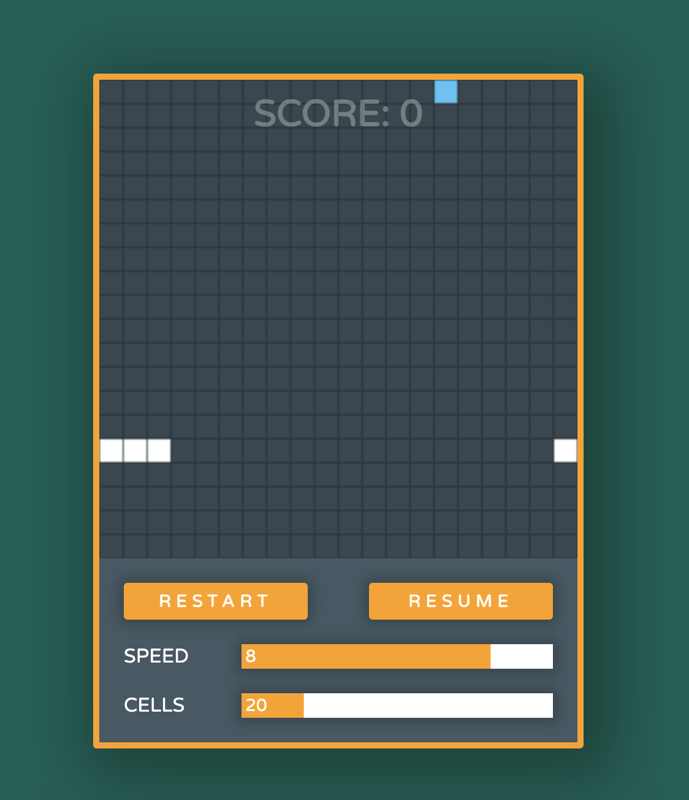

# 🐍 Snake Game

Welcome to the **Snake Game**, a classic and addictive game built using **HTML**, **CSS/SCSS**, and **JavaScript**. It's a fun and challenging project to relive the retro vibes! 🎮

---

## ✨ Features
- **🎨 SCSS Styling**: Clean, modern design with responsive layouts for different screen sizes.
- **💡 JavaScript Logic**: Core game functionality including movement, collisions, and scoring.

---

## 🚀 Technologies Used

- **HTML**: For structuring the game canvas and UI.
- **CSS/SCSS**: For styling the game and making it visually appealing.
- **JavaScript**: For the game logic.

---

## 📷 Demo Screenshot

